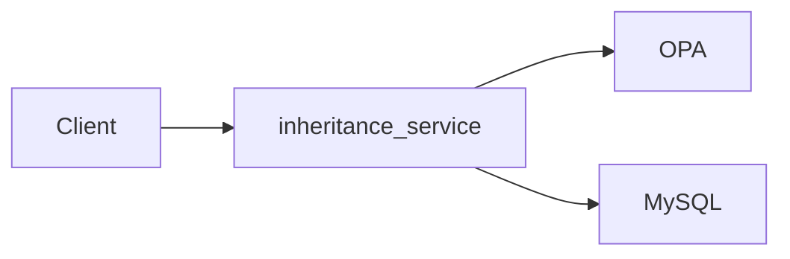

# ABAC_NII Project Setup Guide

This guide will help you set up and run the ABAC_NII project using Docker. The project consists of an inheritance service, OPA (Open Policy Agent), and a MySQL database.

## Project Overview

The current stack is a FastAPI-based inheritance service that evaluates access decisions via OPA and persists data in MySQL.



## Prerequisites

- Python 3.10 or higher
- Docker and Docker Compose
- Poetry (Python dependency management)
- MySQL client (optional, for manual database operations)

## Project Structure

The project contains the following main components:

- **inheritance_service**: FastAPI service for handling inheritance logic (port 5004)
- **opa**: Open Policy Agent service (port 8181)
- **mysql**: MySQL 8.0.32 database (port 3306)

## Setup Instructions

### 0. Get the code

From your terminal, clone the repository and move into the project root:

```bash
cd inheritance_service

# Create virtual environment (using Python 3.10+)
python3 -m venv venv

# Activate virtual environment
# On macOS/Linux:
source venv/bin/activate
# On Windows:
# venv\Scripts\activate

# Install Poetry if not already installed
pip install poetry

# Configure Poetry to create virtual environments in the project directory
poetry config virtualenvs.in-project true

# Install project dependencies
poetry install
```

### 1. Configure Environment Variables

Create a `.env` file in the `inheritance_service` directory. **This file is required before running docker-compose.** Use the following template for Docker setup:

```bash
# Environment
ENVIRONMENT=local

# Logging (optional, default: 20)
# LOGGING_LEVEL=20

# Database Configuration
# Format: mysql+aiomysql://<username>:<password>@<host>:<port>/<database_name>
# Replace <username>, <password>, <host>, <port>, and <database_name> with your actual values
SQLALCHEMY_DATABASE_URI=mysql+aiomysql://<username>:<password>@<host>:<port>/<database_name>

# OPA (Open Policy Agent) Configuration (use Docker service hostname)
OPA_URL=http://opa:8181/v1/data/policy/allow

# JWT configuration (required for protected endpoints such as /request_access)
SECRET_KEY=change-me-to-a-strong-random-value
# ALGORITHM is optional and defaults to HS256 if omitted
# ALGORITHM=HS256

# Optional: SQLAlchemy Engine Options (JSON format)
# SQLALCHEMY_ENGINE_OPTIONS={}

# Optional: Enable SQL query logging
# SQLALCHEMY_ECHO=false
```

**Important**:
- Never commit the `.env` file to version control
- Set `SECRET_KEY` to a strong random value; it is used for JWT validation on protected endpoints
- Use `mysql` and `opa` as hostnames (Docker service names) in the connection strings

### 2. Start Docker Services

From the project root directory, start all Docker services:

```bash
# Build and start all services
docker-compose up -d

# View logs (optional)
docker-compose logs -f

# Check service status
docker-compose ps
```

This will start:
- MySQL database on port 3306
- OPA service on port 8181
- Inheritance Service on port 5004

### 3. Create Database

Connect to MySQL and create the database:

```bash
# Using Docker exec
# Replace <username> and <password> with your MySQL credentials from docker-compose.yml
docker-compose exec mysql mysql -u <username> -p<password>

# Or using MySQL client directly
# Replace <username>, <password>, <host>, and <port> with your actual values
mysql -u <username> -p<password> -h <host> -P <port>
```

### 4. Run Database Migrations

```sql
CREATE DATABASE IF NOT EXISTS <database_name>;
EXIT;
```

**Note**: Replace `<database_name>` with your actual database name. Make sure it matches the database name used in your `SQLALCHEMY_DATABASE_URI` environment variable.

### 5. Set Up Pre-commit Hooks

Install and configure pre-commit hooks for code quality checks:

```bash
# Ensure you're in the inheritance_service directory with venv activated
cd inheritance_service
source venv/bin/activate  # On macOS/Linux
# venv\Scripts\activate  # On Windows

# Install pre-commit (if not already installed globally)
pip install pre-commit

# Install git hooks
make install-git-hooks
# Or directly:
# pre-commit install --hook-type pre-commit
# pre-commit install --hook-type commit-msg

# Test pre-commit hooks (optional)
pre-commit run --all-files
```

Pre-commit hooks will automatically run on:
- Code formatting (Black, Ruff)
- Type checking (mypy)
- Secret detection
- Commit message linting

### 6. Run Database Migrations

Run migrations **after** the MySQL container is up and the database has been created. With your virtual environment activated and from the `inheritance_service` directory:

```bash
# Navigate to inheritance_service directory
cd inheritance_service

# Activate virtual environment (if not already activated)
source venv/bin/activate  # On macOS/Linux
# venv\Scripts\activate  # On Windows

# If migrations/versions/ is empty, generate the initial migration first:
docker-compose run --rm -v $(pwd)/inheritance_service/migrations:/app/migrations inheritance_service poetry run alembic revision --autogenerate -m 'initial'

# Apply migrations
docker-compose exec inheritance_service poetry run alembic upgrade head
```

### 5. Verify Setup

Check that all services are running:

```bash
# Check Docker services
docker-compose ps

# Test inheritance service (should return 200 OK)
curl http://localhost:5004/docs

# Test OPA service
curl http://localhost:8181/health
```

## Stopping Services

To stop all Docker services:

```bash
docker-compose down

# To also remove volumes (WARNING: This will delete all data)
docker-compose down -v
```

## Troubleshooting

### Database Connection Issues

- Ensure MySQL container is running: `docker-compose ps`
- Verify database credentials in `.env` file (root/123456, host: mysql)
- Check MySQL logs: `docker-compose logs mysql`

### Migration Issues

- Ensure the database exists before running migrations (step 3)
- Verify `SQLALCHEMY_DATABASE_URI` in `.env` uses `mysql` as host

### Environment Variable Issues

- Ensure `.env` file exists in the `inheritance_service` directory before running `docker-compose up`
- Check that all required variables are set (ENVIRONMENT, SQLALCHEMY_DATABASE_URI, OPA_URL, SECRET_KEY)
- For Docker: use `mysql` and `opa` as hostnames, not localhost

### Port Conflicts

If ports are already in use, modify the port mappings in `docker-compose.yml`:

```yaml
ports:
  - "5005:5004"  # Change external port from 5004 to 5005
```

## Tribute

This repository was initially developed from another project. We acknowledge and thank the original authors for their foundational work.

- **Original repository**: [original-repo-url](https://github.com/ducminh-phan/fastapi-service-template)

## Additional Resources

- FastAPI documentation: https://fastapi.tiangolo.com/
- Alembic documentation: https://alembic.sqlalchemy.org/
- Docker Compose documentation: https://docs.docker.com/compose/
- Inheritance service internals and API details: `inheritance_service/README.md`
- OPA policy used by this project: `opa/policy.rego`
